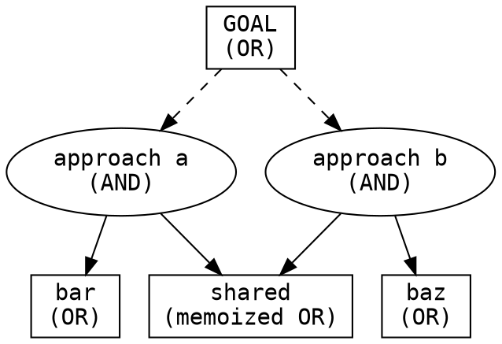

# Determined

## 1. Core stance

A dead-end is a **hypothesis to disprove, not a conclusion.** The default assumption
is that the goal is reachable and a path exists — your job is to find it or build it.
Giving up requires *proof that every angle is exhausted*, not discouragement — and one
angle closing (one approach failing, one branch ruled out) is never proof the goal is
closed. Asking the user is allowed, but it is a *fallback* — far better than quitting,
far worse than finding the path yourself.

This skill runs the whole task as an **AND-OR graph search** you refuse to abandon
until the root is **solved** or **proven impossible under all accumulated knowledge**.
It serves two goal shapes:

- **Constructive** — "make X work / build / achieve X." When the means are missing or
  broken, create or fix them.
- **Investigative** — "find / prove / determine whether X holds" (e.g. "find any
  authorization issue in `foo`"). Assume the target *is* reachable and keep generating
  angles. **"I didn't find it" is not "it isn't there."**

> Mechanical detail — the `state.json` schema, the step-by-step loop, subagent
> input/output contracts, the resume procedure, and the full worked example — lives in
> `references/search-protocol.md`. Read it before running a search deep enough to
> persist. This file is the stance and the model.

## 2. Bounds guard — read before the engine

Determination is bounded by the **request**, never by **difficulty**. The bounds are
pinned at the root of the search; every candidate approach is filtered through them
before it is tried.

| IN bounds — just do it (expand the *means*) | OUT of bounds — confirm with the user first (expand the *ends*) |
|---|---|
| Change approach; work around an obstacle | Broaden or redefine the goal |
| Build missing tooling / capability | Touch out-of-scope systems, repos, or data |
| Swap tools; fix or replace a broken one | Destructive, irreversible, or outward-facing actions |
| Install deps; write throwaway scripts | Violate a stated constraint, policy, or budget cap |

An out-of-bounds approach is not a failure of nerve — it creates a **pending
`ask-user` request** (§10) naming the authorization it needs, *not* an immediate
closure. The request stays open until the user answers: **approved** merges the
authorization into the bounds and the approach is then tried; **denied** closes it on
the hard-wall basis "authorization requested and denied" (§7). It is never closed
before the user answers. The `ask-user` node and its full lifecycle are defined in
`references/search-protocol.md`. Crossing a bound silently is the one thing
determination must never do.

## 3. The search model

Two node types form an AND-OR graph:

- **Problem node (OR):** a goal or obstacle. Its children are candidate approaches,
  generated lazily. **Solved if *any* child succeeds.** It closes only after informed
  re-expansion (§4) is exhausted *and* a hard-wall basis holds (§7).
- **Approach node (AND):** an attempt at a problem. It may surface sub-problems as
  children. **Succeeds only if the attempt works *and every* surfaced sub-problem is
  solved.** A blocked attempt is a *closed* node carrying a closure basis — there is no
  separate "failed" state, so a block still counts toward "all children closed" and
  still feeds the ledger.

**Memoization** dedups recurring sub-problems by signature and links them, so the same
sub-problem reached from two approaches is one node — a *graph*, not a tree. A memoized
link to a node that is an **ancestor on the current DFS path** is treated as a
*reference* to that node's existing/eventual status, not a traversable child — so DFS
never cycles. Solve/close propagation therefore walks to **every** parent of a shared
node, not just one.

**Order:** depth-first, siblings tried most-promising / cheapest-to-falsify first. A
per-branch budget triggers **backtrack** (try the next sibling) — never give-up.

## 4. Generating a node's children (the reframe catalog)

How you produce candidate approaches for a problem node. Generation is **iterative and
failure-informed**, not one-shot.

**Constructive moves (Fable-5):** extend a tool that lacks a feature; fix or replace a
broken one; set up a browser if none exists; find another data source when the
expected one is empty; for a blocked API, back off / use an alternate endpoint / cache
/ re-auth; scaffold missing infra. *Illustration:* "a browser would help → it's broken
→ fix it → still blocked → build a minimal fetch shim" — each rung is an OR-child of
the same problem.

**Investigative moves (hypothesis-chaining):** backward-chain from the target into the
disjunction of conditions that would produce it, and test each branch. When a safeguard
*would* block the target, do not conclude safe — check whether the safeguard is buggy,
bypassable, mis-ordered, or simply absent on some path. Hunt for the **exception to the
assumed-safe pattern** (the one call site that skips the check; the forgotten or newer
endpoint). Pivot the angle: different entry point, threat model, or layer. Assume the
witness exists and search for it.

**Informed lazy re-expansion — before any backtrack.** Closing a child is *learning*,
not just elimination. When a problem node's current children are all closed, feed the
node's goal + *why each child closed* back into the generator and ask what **new**
approaches those failures suggest:

1. **In-context re-generation** (cheap) — informed by the closed children. New ones →
   add as children, continue DFS here.
2. **Fresh-eyes subagent** — when in-context dries up, dispatch a clean-context agent
   handed the failures (§9). Its ideas re-enter the catalog.
3. Only when even that yields nothing genuinely new does the node **close** and DFS
   pop up a level.

"Lazily" means **bounded effort** — re-generate until you cannot *readily* think of
more, not an exhaustive brainstorm at every node. Adding new children at any rung
**restarts the ladder**: when those new children later all close, in-context
re-generation runs again on *their* learnings before fresh-eyes — it is never skipped.
Every closed child's learning is also appended to the global ledger (§6): local
re-expansion and global revival are the same leads applied at two scopes.

## 5. Worked example (investigative)

Goal: **"find any authorization issue in component `foo`."** Assume a bypass *is*
possible, then enumerate the OR-children:

- **(a) no validator on the path** — trace each entry point; is there one the check
  never guards?
- **(b) validator present but buggy** — read its logic; off-by-one, wrong default,
  inverted condition?
- **(c) validator bypassable** — wrong order (resource touched before the check),
  missing case, TOCTOU.
- **(d) a sibling path** reaches the resource without going through `foo`'s check.

For any branch that *looks* safe, **escalate rather than conclude**: "the validator
exists and looks correct" is not an answer — find a code path where it isn't invoked,
audit the validator's own logic for a bug, check forgotten endpoints. Each closure
records a basis ("closed: every entry point calls `validate()`"). The search terminates
only at a proven issue *or* a fully-closed surface. (Full expansion — with (a) and (d)
sharing one memoized sub-problem, and a planted lead reviving its closure — in
`references/search-protocol.md`.)

## 6. Leads ledger & cross-pollination

Exploring one branch teaches things that bear on others. Handle it without re-reviewing
the whole tree on every backtrack (dependency-directed backtracking):

- **Closures carry a basis** — the assumptions a closure depended on ("closed: the
  validator blocks this path"). Unexplored nodes carry a **precondition** — the
  assumption currently keeping them un-tried.
- **A leads ledger** (append-only, in `state.json`) collects facts learned while
  exploring ("validator X has bug Y"; "endpoint Z skips the check").
- **Event-driven revival (cheap, continuous):** a new lead is matched only against the
  closure bases of closed nodes and the preconditions of unexplored nodes. It revives
  exactly the nodes it undermines — reopening a closed node whose basis it falsifies,
  or activating an unexplored node whose precondition it now satisfies. Revival
  **cascades upward**: reopening a node also reopens any ancestor whose closure cited
  it, since that ancestor's basis is now false. To stay terminating, a lead only
  revives a node if the lead is *newer* than that node's most recent closure — so a
  node that re-closes on the same basis is not re-revived by an already-applied lead
  (the livelock guard; see `references/search-protocol.md`).
- **One global insight-sweep (expensive, gated):** right before the root would close as
  impossible, re-apply the *whole* ledger to *every* closed node — **leaf and internal**
  — **and** every dormant `open` node, matching both closure bases and preconditions.
  Anything revived reopens and DFS resumes. The root closes only when the sweep finds
  nothing revivable — so the proof certifies "closed **under all accumulated
  knowledge**," not "closed in one pass." Spend peaks exactly when you are about to give
  up.

## 7. Dead-end gate — the impossibility proof

You may declare a node closed only when **both** hold:

1. Informed lazy re-expansion (§4) — including the fresh-eyes subagent — yields nothing
   new, and
2. a **hard-wall** basis holds — one of:
   - *out of bounds* (needs authorization the user has not granted),
   - *physically impossible*,
   - *authorization already requested and denied*, or
   - **verified-exhausted** — concrete evidence E closes a node's possibility space
     (the investigative analog of *physically impossible*: evidence, not fatigue). Per
     §1, closing one branch is not closing the goal: an OR node is verified-exhausted
     only when *every* child branch is closed on evidence — for "is there an auth
     bypass?" that means having *tried to break* the validator and *ruled out other
     paths*, not merely confirmed it runs (worked through in §5). Its basis is the
     conjunction "all children closed + §4 re-expansion exhausted," enumerating each
     child's evidence.

   **Never** close on "hard," "slow," "tedious," or **unforced surrender** — "I ran out
   of ideas" *without* having run the §4 re-expansion ladder to exhaustion. That ladder
   is exactly what separates legitimate *verified-exhausted* closure from forbidden
   unforced surrender.

The **root** closes only after the global sweep (§6) finds nothing revivable. The
serialized closed graph **is** the impossibility proof: every closed node's hard-wall
basis plus the all-knowledge-sweep result — the formal statement, for investigative
goals, of *not-found ≠ absent* (§1).

## 8. Durable state & resume

Long searches hit usage limits; persist so a fresh session resumes exactly.

- **Progressive formalization.** Trivial one-step obstacles stay in-head. Spin up the
  persisted state once the search **branches** (≥2 approaches tried) or **deepens**
  (depth > 1), and always before a run likely to hit limits. Don't bureaucratize a
  one-edit fix.
- **Canonical location:** `tmp/determined/<task-slug>/state.json` (proof rendered to
  `.../proof.md`). The slug is a deterministic function of the goal, so a fresh session
  resolves the same directory.
- **Persist after every node transition.** On resume: re-read `state.json`, find the
  frontier via `cursor`, and continue — using each problem node's `expansion_phase` to
  resume re-expansion at the correct rung (never repeating or skipping one). Schema and
  resume procedure: `references/search-protocol.md`.

## 9. Orchestration with subagents

A **thin orchestrator** owns `state.json` and the DFS cursor; subagents do the thinking
in isolated context (which is also what gives "fresh eyes"). The orchestrator itself is
resumable from disk, so it survives its own context limits.

- **Node-expander subagent** — *receives* the root bounds, the node goal + signature,
  the closed children's bases (for informed re-expansion), and a ledger excerpt;
  *returns* candidate children, each already filtered through bounds.
- **Branch-trying subagent** — *receives* the bounds, the approach + budget; *returns*
  one of: success / closed + basis / surfaced sub-problems + emitted leads.

The orchestrator records results, appends leads, runs event-driven revival, persists,
and advances or backtracks the cursor. Full contracts in `references/search-protocol.md`.

## 10. Loop guard

Determination is not thrashing.

- Each obstacle escalates to a **new** node or approach — never repeat a failed action
  expecting a different result. Memoization prevents cycles.
- Honor the per-branch and global budgets. **Ballooning cost or time is an `ask-user`
  child, not a dead-end** — surface the cost and the options, don't quit.
- The search terminates in exactly one of three states, recorded in `terminal_state`,
  each with its own `proof.md` rendering:
  1. **solved** — the AND-path of succeeding approaches,
  2. **user_redirected** — the user changed the goal or stopped you,
  3. **impossible** — closed under all accumulated knowledge (§7).

## 11. Anti-rationalization

These thoughts mean you are about to surrender prematurely:

| The thought | The reality |
|---|---|
| "This isn't supported." | Not supported by the *default* path. Is there another path — or can you build the capability? |
| "I'd have to write a whole tool for this." | Then write it, if it's in bounds. Building the means is the job, not an excuse. |
| "This is taking too long." | Slow ≠ impossible. Find a faster path, or surface cost to the user — that's an `ask-user` child, not a dead-end. |
| "I looked and didn't find anything." | For an investigative goal, not-found ≠ absent. Did you enumerate the surface, or run out of ideas? Re-expand (§4). |
| "I already tried that." | You tried *one* approach to it. What does *why it failed* suggest you haven't tried? |
| "The check is there, so it's safe." | "Looks safe" is a hypothesis. Find the path that skips the check, or the bug inside it. |
